# ワイン品質分析

ポルトガル北部産の赤と白のヴィーニョヴェルデワインのサンプルに関連する 2 つのデータセットが含まれています。

このリポジトリには、赤ワインと白ワインの品質データセットに関する分析とグラフ化を行っています。本プロジェクトの目標は、機械学習を用いた予測モデルからワインの品質に影響を与える要因を理解することです。

## データセット

このプロジェクトで使用されているデータセットは、[UCI機械学習リポジトリ](https://archive.ics.uci.edu/ml/datasets/Wine+Quality)から取得したものです。データには、赤ワインと白ワインのさまざまな理化学的特性とその品質評価が含まれています。

- `WineQuality-RedWine.csv`: 赤ワインのサンプル数　1599
- `WineQuality-WhiteWine.csv`: 白ワインのサンプル数　4898
  
###　特徴量の説明

このデータセットには、特徴量は11種です。

## データセットの説明

このデータセットには、特徴量は11種です。

| 特徴量名             | 和訳       |
|----------------------|------------|
| fixed acidity        | 固定酸     |
| volatile acidity     | 揮発酸     |
| citric acid          | クエン酸   |
| residual sugar       | 残糖       |
| chlorides            | 塩化物     |
| free sulfur dioxide  | 遊離亜硫酸 |
| total sulfur dioxide | 総亜硫酸   |
| density              | 密度       |
| pH                   | pH         |
| sulphates            | 硫酸塩     |
| alcohol              | アルコール度数 |

    
## 分析と結果

### データの分布

#### 赤ワインの品質分布
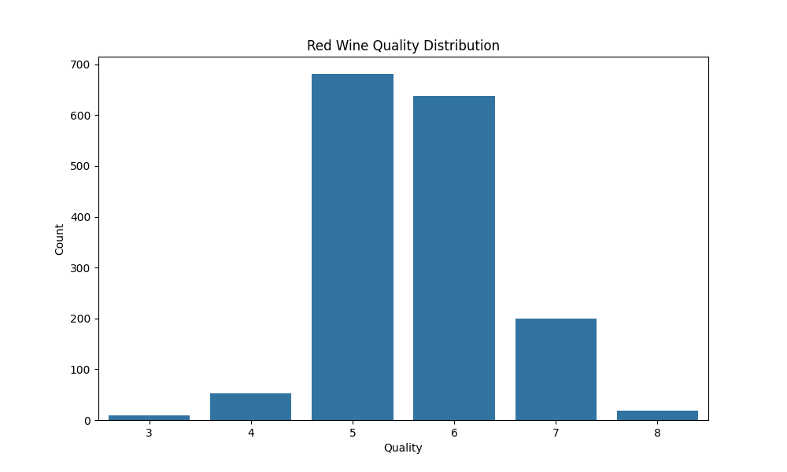

- 品質評価は3から8の6段階評価
- 大多数の赤ワインは5から6の間で評価されているため、データの偏りがある。

#### 赤ワインの各特徴量の散布図

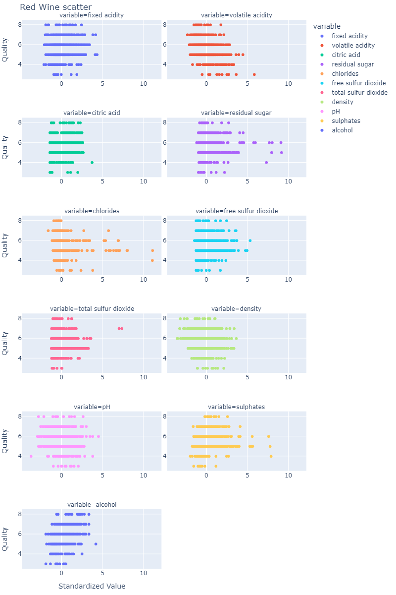

#### 白ワインの品質分布
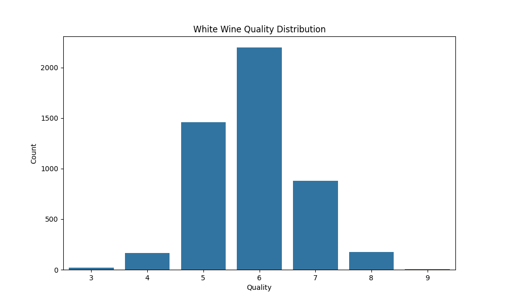

- 品質評価は3から9までの範囲です。
- 大多数の白ワインは5から6の間で評価されており、特に6の評価が多いです。

#### 白ワインの各特徴量の散布図
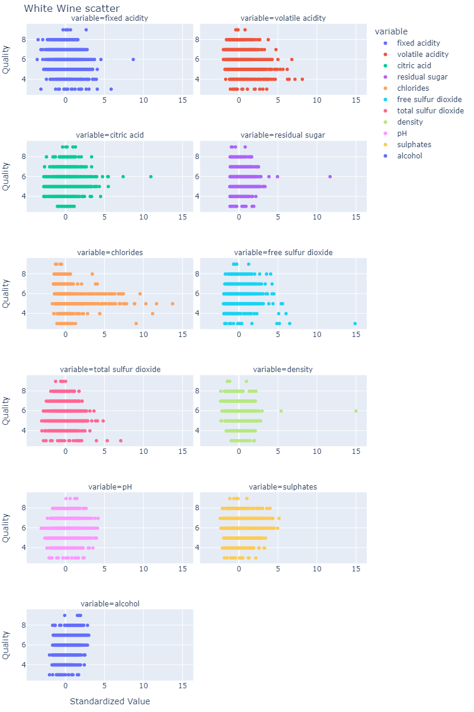

### 機械学習モデル

ワインの品質を予測するために、赤ワインと白ワインの線形回帰モデルとランダムフォレストモデルをそれぞれ2つ機械学習モデルを構築.
線形回帰モデルでは、各特徴量の回帰係数による比較、PFI、PD、ICEによる分析を行った。

#### モデル評価

| モデル            | 赤ワイン MSE | 赤ワイン RMSE | 赤ワイン R^2 | 白ワイン MSE | 白ワイン RMSE | 白ワイン R^2 |
|-------------------|--------------|---------------|--------------|--------------|---------------|--------------|
| 線形回帰モデル    | 0.3900       | 0.6245        | 0.4032       | 0.5690       | 0.7543        | 0.2653       |
| ランダムフォレスト| 0.3014       | 0.5490        | 0.5389       | 0.3481       | 0.5900        | 0.5505       |


### 線形回帰モデルを回帰係数による比較

ここでは、線形回帰による予測モデルの回帰係数を比較し、重要度の比較を行う。

#### 赤ワインの特徴量重要度
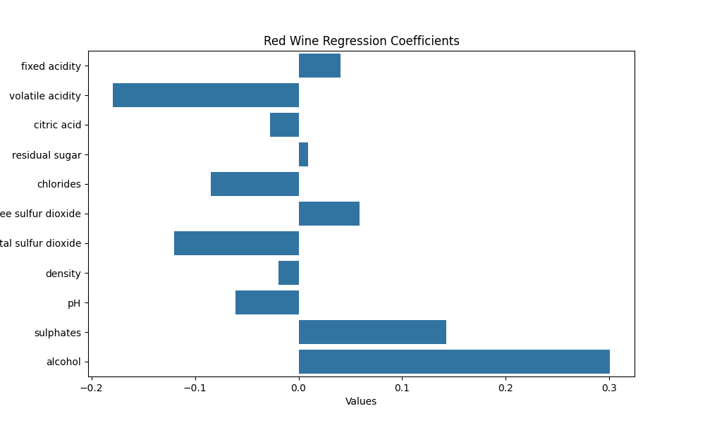

- `アルコール`と`揮発性酸度`が赤ワインの品質に最も影響を与える重要な特徴です。

#### 白ワインの特徴量重要度
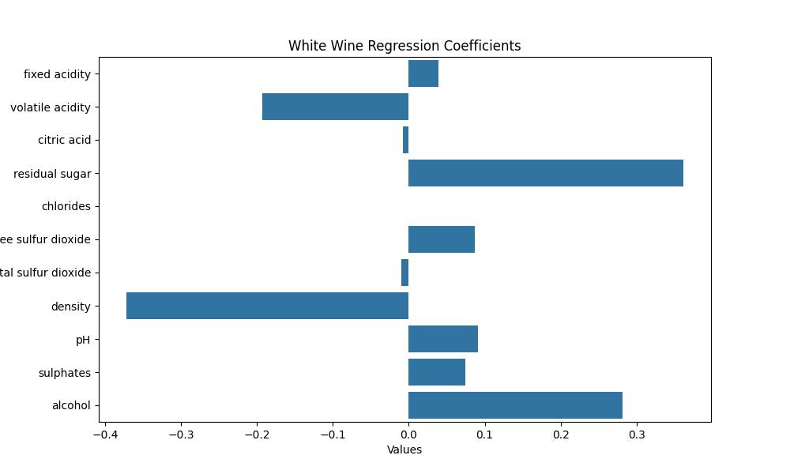

- `アルコール`と`密度`が白ワインの品質に最も影響を与える重要な特徴です。

### 線形回帰モデルをPFIによる比較

#### 赤ワインの特徴量重要度
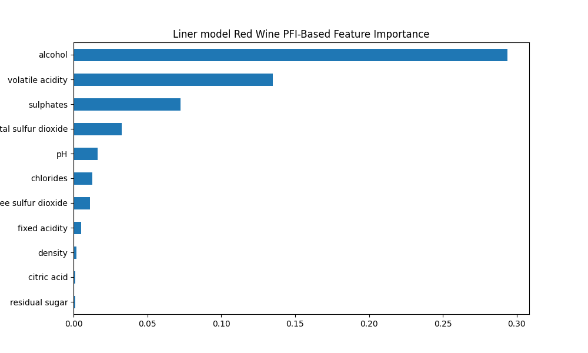

#### 白ワインの特徴量重要度
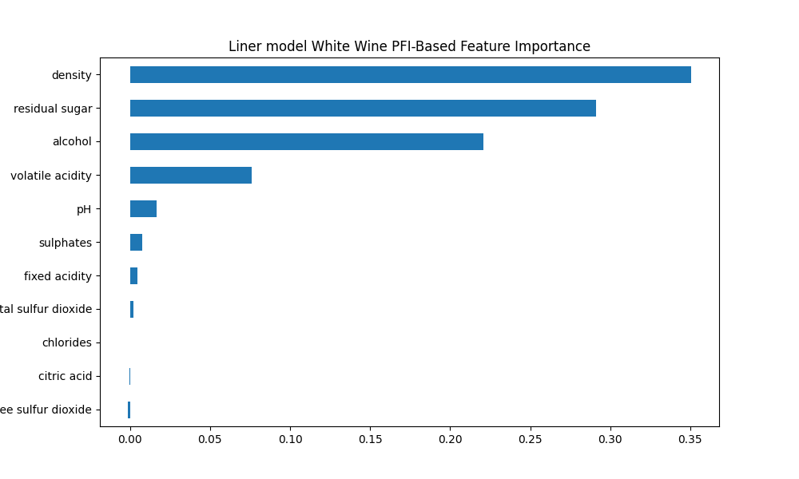

### 線形回帰モデルをPD,ICEによる比較

#### 赤ワインの特徴量重要度
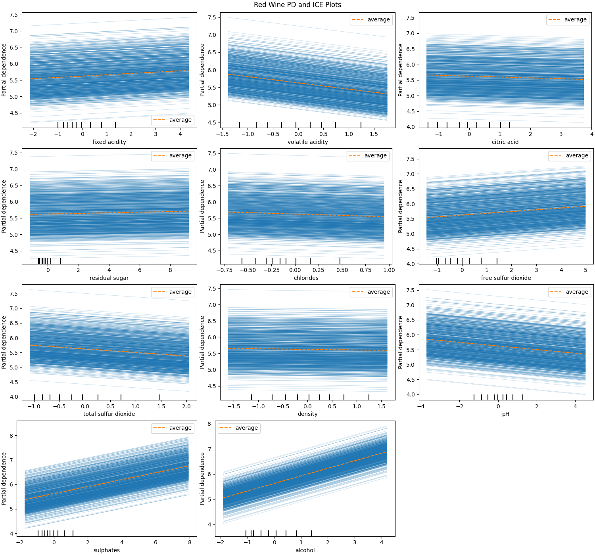

#### 白ワインの特徴量重要度
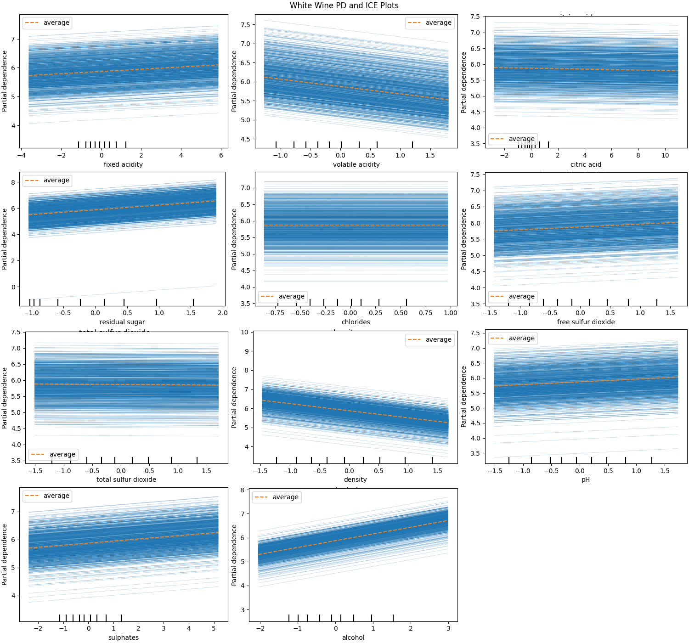

### ランダムフォレストモデルをPFIによる比較

#### 赤ワインの特徴量重要度
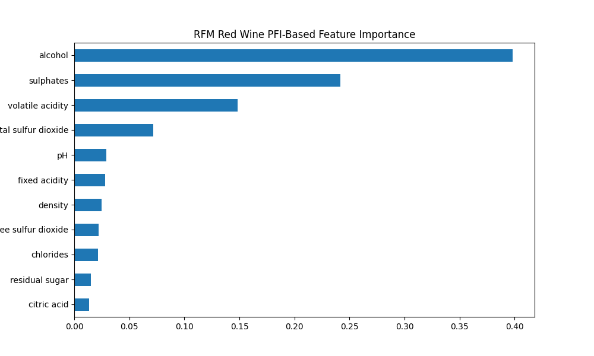

#### 白ワインの特徴量重要度
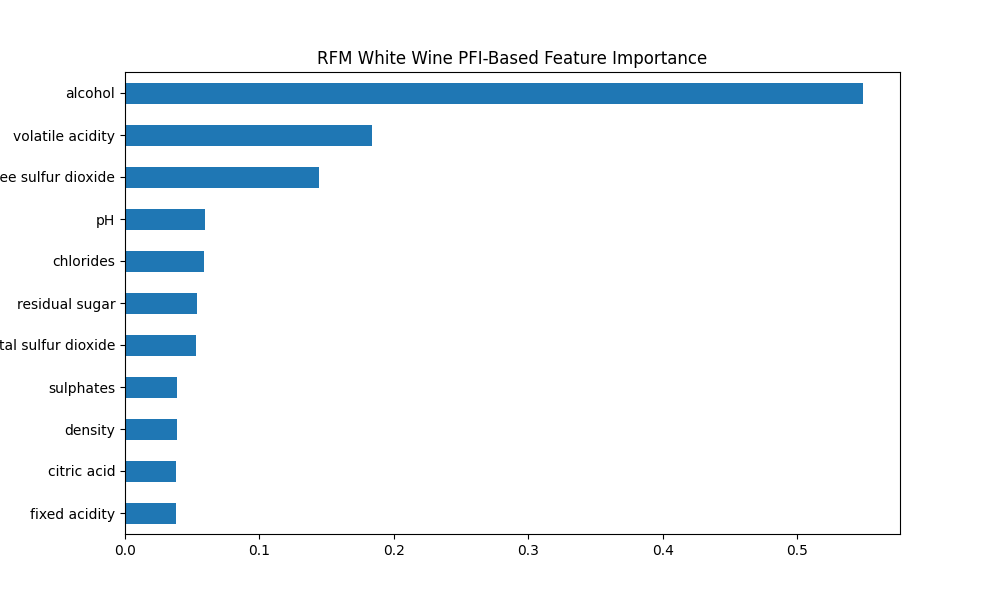

### ランダムフォレストモデルをPD,ICEによる比較

#### 赤ワインの特徴量重要度
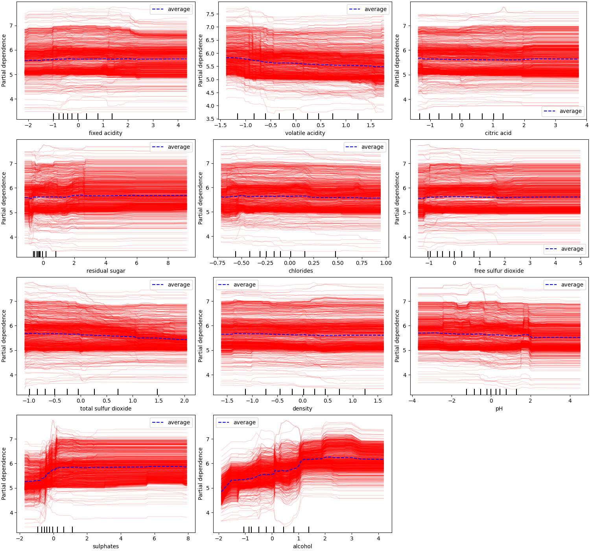

#### 白ワインの特徴量重要度
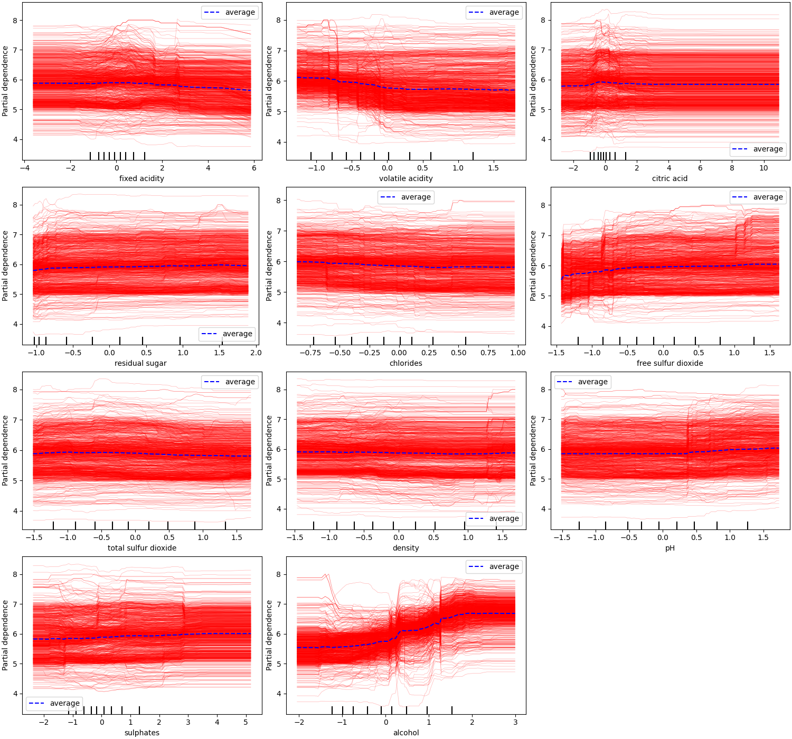
中心の青い太線がPDで周囲にある細い赤線がICEになります。各インスタンスの特徴量の変化が予測値に及ぼす影響を確認している。平均的な傾向から異なる動きを見せるインスタンスも存在している。

##　課題

品質が最も高いクラスのインスタンスの特性が及ぼす影響を確認することで、品質向上に必要な要素を見つけ出すこと。

# 環境構築の手順
### 1. 仮想環境の作成
環境名 `myenv`は例として挙げています。
```bash 
python -m venv myenv
```
### 2. 仮想環境のactivate
Windows:
```bash
myenv\Scripts\activate
```
macOS and Linux:
```bash
source myenv/bin/activate
```
### 3. ライブラリのインストール
```bash
pip install -r requirements.txt
```
## 主な使用ライブラリ

- Python
- Pandas
- Matplotlib
- Seaborn
- scikit-learn
- Juypter

## 筆者の環境

- Python 3.9.13 (3.10で仮想環境の作成に問題があるため非推奨)
- Windows 11
- Vscode

## 参考文献

- <出版社>技術評論社
- <著者>森下光之助

